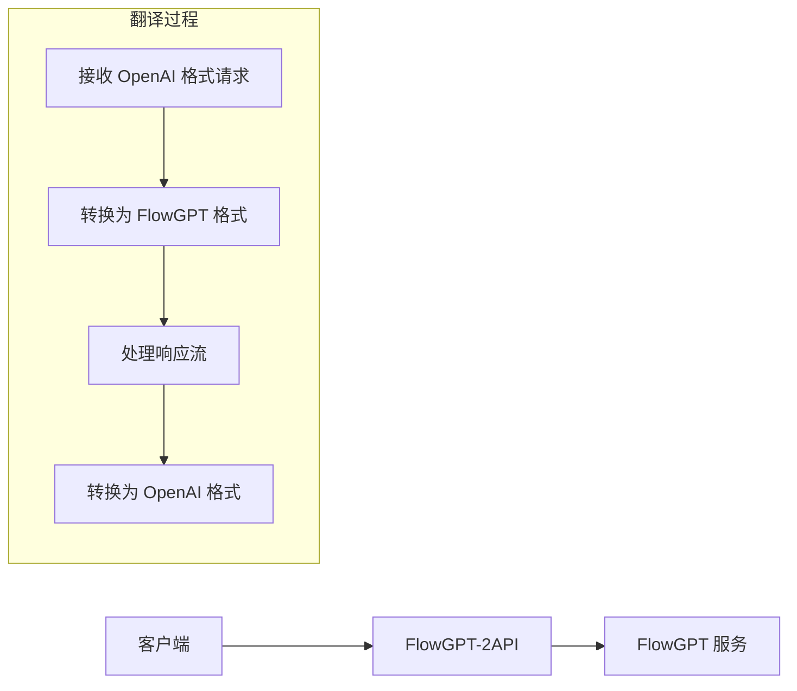

<div align="center">

# ✨ FlowGPT-2API ✨

**将 FlowGPT 免费模型转换为 OpenAI 兼容 API 的高性能代理服务**


</div>

---

> 🌌 **"我们不是在编写代码，我们是在铸造连接思想的桥梁。"**
>
> 在数字世界的浩瀚星海中，无数强大的语言模型如同孤立的星辰，各自闪耀。`FlowGPT-2API` 正是连接这些星辰的桥梁，让任何人都能轻松驾驭 AI 的力量。

## 📖 目录

- [✨ 核心特性](#-核心特性)
- [🎯 工作原理](#-工作原理)
- [🏗️ 项目架构](#️-项目架构)
- [🚀 快速开始](#-快速开始)
  - [Docker 一键部署](#docker-一键部署)
  - [手动部署](#手动部署)
- [🔧 详细配置](#-详细配置)
  - [获取凭证](#获取凭证)
  - [环境配置](#环境配置)
- [💻 API 使用](#-api-使用)
- [🔬 技术实现](#-技术实现)
- [📋 开发计划](#-开发计划)
- [🌟 应用场景](#-应用场景)
- [📄 开源协议](#-开源协议)

---

## ✨ 核心特性

- **💸 完全免费** - 利用 FlowGPT 的免费模型，无需支付 API 调用费用
- **🔌 无缝兼容** - 100% 兼容 OpenAI API 格式，现有代码无需修改
- **⚡ 流式响应** - 完整支持流式传输，实现打字机效果
- **🐳 容器化部署** - 提供 Docker 支持，一键部署
- **🧠 智能上下文** - 自动管理对话上下文，支持多轮对话
- **🎯 多模型支持** - 支持 GPT-4 Free、ChatGPT-5 Pro 等多个模型

## 🎯 工作原理

`FlowGPT-2API` 充当 OpenAI API 和 FlowGPT 服务之间的翻译器：



**工作流程详解：**

1. **接收请求** - 监听标准 OpenAI API 端点 (`/v1/chat/completions`)
2. **格式转换** - 将 OpenAI 格式的消息转换为 FlowGPT 所需的格式
3. **会话管理** - 为每个请求创建独立的 FlowGPT 会话并注入完整上下文
4. **签名验证** - 生成动态签名通过 FlowGPT 的安全验证
5. **流式处理** - 实时清理和转换响应数据流
6. **格式返回** - 将响应转换为标准 OpenAI 格式返回

## 🏗️ 项目架构

```
flowgpt-2api/
├── 📄 .env                    # 环境配置文件
├── 📄 .env.example            # 环境配置模板
├── 📄 Dockerfile              # Docker 构建文件
├── 📄 docker-compose.yml      # Docker 编排配置
├── 📄 main.py                 # FastAPI 应用入口
├── 📄 nginx.conf              # Nginx 反向代理配置
├── 📄 requirements.txt         # Python 依赖列表
└── 📂 app/                    # 核心代码目录
    ├── 📂 core/
    │   └── 📄 config.py       # 配置管理和模型映射
    ├── 📂 providers/
    │   ├── 📄 base_provider.py    # 提供者基类
    │   └── 📄 flowgpt_provider.py # FlowGPT 服务实现
    └── 📂 utils/
        └── 📄 sse_utils.py    # Server-Sent Events 工具
```

## 🚀 快速开始

### Docker 一键部署

**前提条件：** 已安装 Docker 和 Docker Compose。

1. **克隆项目**
   ```bash
   git clone https://github.com/lzA6/flowgpt-2api.git
   cd flowgpt-2api
   ```

2. **配置环境变量**
   ```bash
   cp .env.example .env
   # 编辑 .env 文件，填入你的 FLOWGPT_BEARER_TOKEN
   ```

3. **启动服务**
   ```bash
   docker-compose up -d
   ```

4. **验证部署**
   ```bash
   curl http://localhost:8088/v1/models \
     -H "Authorization: Bearer your-secret-key"
   ```

### 手动部署

1. **安装依赖**
   ```bash
   git clone https://github.com/lzA6/flowgpt-2api.git
   cd flowgpt-2api
   pip install -r requirements.txt
   ```

2. **配置环境变量**（同上）

3. **启动服务**
   ```bash
   uvicorn main:app --host 0.0.0.0 --port 8000
   ```

## 🔧 详细配置

### 获取凭证

1. 访问 [FlowGPT](https://flowgpt.com/) 并登录
2. 打开浏览器开发者工具 (F12)
3. 切换到 Network 标签页
4. 与任意模型对话，找到 `chat` 请求
5. 复制请求头中的：
   - `authorization` 字段 (Bearer 后面的部分) → `FLOWGPT_BEARER_TOKEN`
   - `x-flow-device-id` 字段 → `FLOWGPT_DEVICE_ID`

### 环境配置

编辑 `.env` 文件：

```env
# API 访问密钥（建议修改为复杂密码）
API_MASTER_KEY=your-secret-key-here

# 服务端口
NGINX_PORT=8088

# FlowGPT 凭证（从浏览器获取）
FLOWGPT_BEARER_TOKEN=eyJhbGciOiJIUzI1NiIsInR5cCI6IkpXVCJ9...
FLOWGPT_DEVICE_ID="aORT9gbujH92iIVYYVcTE"

# 可选：请求超时设置（秒）
REQUEST_TIMEOUT=30
```

## 💻 API 使用

### 聊天补全接口

```bash
curl http://localhost:8088/v1/chat/completions \
  -H "Content-Type: application/json" \
  -H "Authorization: Bearer your-secret-key" \
  -d '{
    "model": "gpt-4-free",
    "messages": [
      {"role": "system", "content": "你是一个有用的助手"},
      {"role": "user", "content": "请解释一下人工智能"}
    ],
    "stream": true,
    "temperature": 0.7,
    "max_tokens": 1000
  }'
```

### 获取模型列表

```bash
curl http://localhost:8088/v1/models \
  -H "Authorization: Bearer your-secret-key"
```

### 支持的模型

当前支持的模型映射（在 `app/core/config.py` 中配置）：

| 模型别名 | FlowGPT Prompt ID | 描述 |
|---------|-------------------|------|
| `gpt-4-free` | `gpt-4-free` | GPT-4 免费版本 |
| `chatgpt-5-pro` | `chatgpt-5-pro` | ChatGPT-5 Pro 模型 |
| `claude-instant` | `claude-instant` | Claude Instant 模型 |

## 🔬 技术实现

### 核心组件

| 组件 | 作用 | 技术亮点 |
|------|------|----------|
| **FastAPI** | Web 框架 | 异步支持，自动 API 文档 |
| **Uvicorn** | ASGI 服务器 | 高性能异步服务器 |
| **Httpx** | HTTP 客户端 | 异步 HTTP 请求 |
| **Nginx** | 反向代理 | 流式传输优化，负载均衡 |

### 关键技术

#### 1. 动态签名生成

```python
def _generate_signature(self, timestamp: int, nonce: str) -> str:
    """生成 FlowGPT 请求签名"""
    sign_str = f"{timestamp}:{nonce}:{self.device_id}"
    return hashlib.md5(sign_str.encode()).hexdigest()
```

#### 2. 上下文注入

```python
async def _create_conversation_with_context(self, messages: List[Dict]) -> str:
    """创建带上下文的对话会话"""
    # 将消息历史转换为 FlowGPT 格式
    # 创建新会话并注入完整上下文
    # 返回 conversation_id 用于后续聊天
```

#### 3. 自适应流清理

```python
def _adaptive_clean_chunk(self, text_chunk: str) -> str:
    """智能清理响应流数据"""
    # 自动检测和处理响应前缀
    # 维护清理状态确保数据完整性
    # 返回纯净的文本内容
```

## 📋 开发计划

### ✅ 已实现功能

- [x] OpenAI API 格式兼容
- [x] 流式响应支持
- [x] 多模型映射
- [x] Docker 容器化
- [x] 上下文管理

### 🔄 计划功能

- [ ] 动态模型发现
- [ ] 多 Token 负载均衡
- [ ] 使用量统计面板
- [ ] 更精细的错误处理
- [ ] 支持更多 AI 服务提供商

### 🐛 已知限制

- 状态管理在多个 worker 实例时可能存在限制
- 模型列表需要手动维护
- 错误处理相对简单

## 🌟 应用场景

### 🎯 适用场景

- **个人项目** - 为个人应用提供免费的 AI 对话能力
- **原型开发** - 在产品原型阶段验证 AI 功能
- **学习研究** - 学习 API 设计和容器化技术的实践案例
- **工具集成** - 与支持 OpenAI API 的第三方工具集成

### 💡 使用示例

**集成到聊天应用：**
```python
import openai

# 配置客户端指向本地服务
client = openai.OpenAI(
    base_url="http://localhost:8088/v1",
    api_key="your-secret-key"
)

response = client.chat.completions.create(
    model="gpt-4-free",
    messages=[{"role": "user", "content": "Hello!"}],
    stream=True
)
```


---

<div align="center">

**🌟 如果这个项目对您有帮助，请给我们一个 Star！**  
**🤝 欢迎提交 Issue 和 Pull Request 一起改进这个项目！**

</div>
